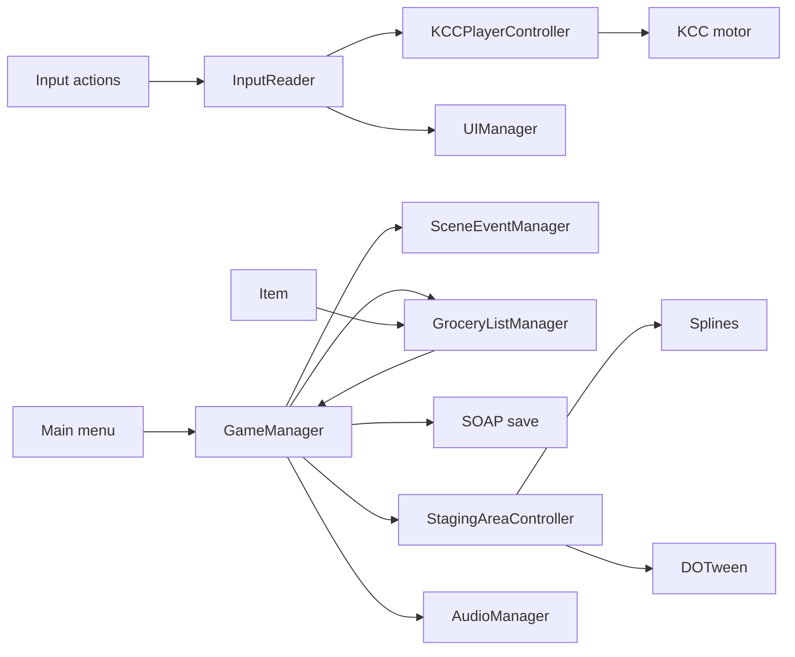

# System map

## Topology

CrazyMarket uses a persistent coordinator plus scene-local adapters:

- `GameManager` owns `GameState`, survives scene loads, discovers the current list/timer/event managers, and controls scene transitions.
- `SceneEventManager` translates state changes into serialized UnityEvents; `UIManager`, `TimerManager`, and `GroceryListManager` project state into scene behavior.
- `InputReader` translates generated Input System callbacks into C# events. KCC movement subscribes directly; UI and debug tooling consume pause/submit/debug events.
- `Item` emits a static identity event. `GroceryListManager` owns requested/collected identity state and requests `EndGame` when complete.
- `GameSaveManager` and `GameSettingsManager` extend vendored SOAP persistence. `AudioManager` and camera systems apply live settings.
- Unity scenes/prefabs provide composition and event wiring; KCC, Cinemachine, DOTween, Splines, and SOAP remain vendor boundaries.

## Important unresolved boundaries

- `InputReader.InteractEvent` has no active subscriber, while `InteractionController` is absent from the active KCC prefab and no active class implements `IInteractable`.
- `EndGame` is requested in source, but persistence/staging occur only in `GameOver`; the connecting trigger is serialized and not fully decoded.
- Current manager fields and serialized prefab/scene property names have drifted, leaving plausible null dependencies.
- The current dirty worktree includes vendor relocation, so authorship/provenance cannot be inferred from Git status alone.

The complete structured topology is in [graph.json](graph.json), with the generated Mermaid fallback in [graph.mmd](graph.mmd).
