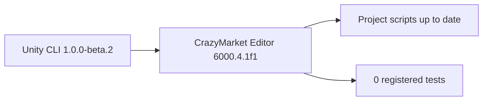

# Verification map

```mermaid
flowchart LR
  CLI[Unity CLI 1.0.0-beta.2] --> Editor[CrazyMarket Editor 6000.4.1f1]
  Editor --> Scripts[Project scripts up to date]
  Editor --> Tests[0 registered tests]
```

The official CLI connects to the live Editor through Pipeline on port `7800` and exposes compilation, console, and test diagnostics.
