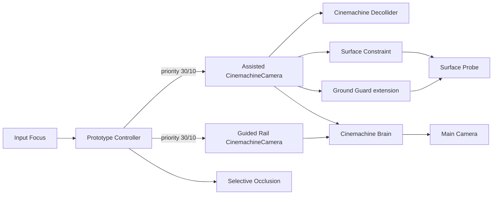

# System map

- `Main Camera`: physical render/audio camera plus Cinemachine Brain; no Collider or Rigidbody.
- `Assisted CinemachineCamera`: player Follow/LookAt, Orbital Follow body, Rotation Composer aim,
  Decollider extension, Ground Guard extension, and Surface Constraint.
- `Guided Rail CinemachineCamera`: Spline Dolly body and Rotation Composer aim; no collision extension.
- `Prototype Controller`: discovers tagged rigs, consumes look input, recenters, and switches live
  camera by priority.
- `Selective Occlusion`: hides only marked walls; it does not reposition the camera.
