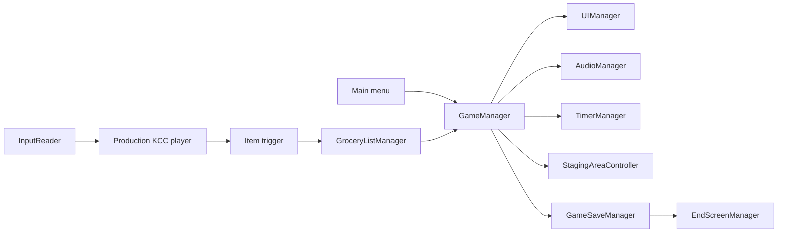

# System map

## Subsystems

- **Campaign lifecycle:** `GameManager`, scene triggers, build-index ordering, and scene-local managers.
- **Shopping:** exact serialized `Item` instances, `GroceryListManager`, staging, and timekeeping.
- **Player:** shipped `KCCPlayerController`; richer V2 controller/profile/ability stack remains a vertical slice.
- **Presentation:** UI, camera, AudioManager, item VFX, staging animation, and results.
- **Persistence:** SOAP-backed latest completion, best completion, completion status, and campaign total.
- **World activity:** a spline NPC in Level 3 and currently dormant interaction/signposting seams.

## Boundary observations

- Production lifecycle consumers name `KCCPlayerController` directly, blocking a drop-in V2 swap.
- Several crucial relations live only in scene/prefab YAML, including state triggers and manager references.
- Test Campus proves improved camera/V2 concepts, but the enabled production campaign still uses older wiring.
